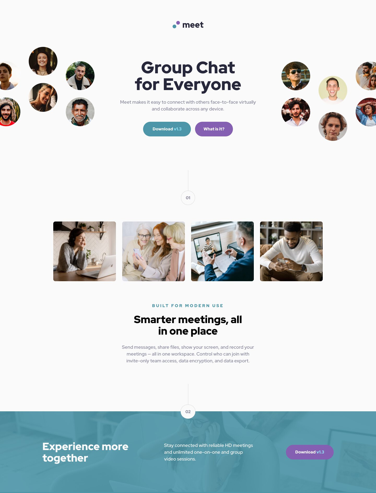
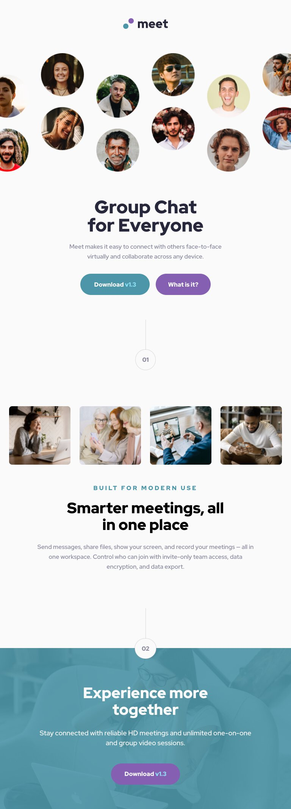

# Frontend Mentor - Meet landing page solution

This is Max Ruuen's solution to the [Meet landing page challenge on Frontend Mentor](https://www.frontendmentor.io/challenges/meet-landing-page-rbTDS6OUR). Frontend Mentor challenges help you improve your coding skills by building realistic projects.

## Table of contents

- [Overview](#overview)
  - [The challenge](#the-challenge)
  - [Screenshot](#screenshot)
  - [Links](#links)
- [My process](#my-process)
  - [Built with](#built-with)
- [Author](#author)

## Overview

### The challenge

Users should be able to:

- View the optimal layout depending on their device's screen size
- See hover states for interactive elements

### Screenshot

#### Desktop Layout

#### Tablet Layout

#### Mobile Layout

### Links

- Solution URL: [Frontend Mentor](https://www.frontendmentor.io/solutions/meet-landing-page-using-scss-and-bem-rkyIL5ISq)
- Live Site URL: [Netlify](https://rd-challenge-meet-page.netlify.app/)

## My process

### Built with

- HTML / CSS
- SCSS
- Flexbox
- CSS Grid
- Mobile-first workflow

## Author

- Frontend Mentor - [@ruuendigital](https://www.frontendmentor.io/profile/ruuendigital)
- Twitter - [@maxruuen](https://www.twitter.com/maxruuen)
